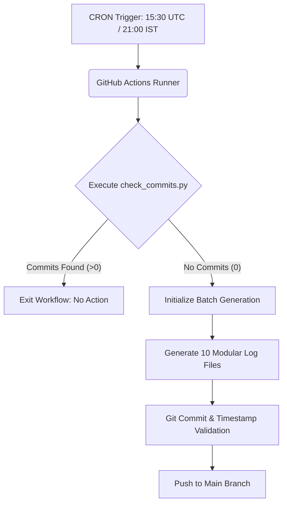

# ⚡ DAILY-LOG AGENT
### *Autonomous Contribution & Activity Synchronization Engine*

 

  <b>A fault-tolerant automation engine designed to keep your GitHub contribution graph active with zero fluff.</b>

---

## 🌟 Overview

**Daily-Log Agent** acts as an invisible background sentinel. Running autonomously on GitHub Actions runners, it verifies author activity across all public and private repositories accessible by your Personal Access Token. 

If no commits are recorded for the current day, it dynamically triggers a fallback batch generator to write structured technical entries (useful algorithms, design patterns, or engineering logs) into the repository.

---

## ✨ Core Features

* **Zero-Spam Verification:** Employs GitHub’s Commit Search API to check across both public and private repositories before triggering.
* **Fail-Safe Circuit Breaker:** Defaults to assuming commits exist in the event of an API failure, preventing erroneous pushes during outages.
* **Batch Commit Scheduling:** Automatically loops 10 distinct, timestamped micro-entries with verified sequential git history.
* **Multi-Mode Content Engine:**
  * `til`: Real-world software engineering facts and memory-efficient tips.
  * `snippet`: Production-ready JavaScript, Python, and shell utility routines.
  * `log`: Corporate private work changelog summaries.
* **Zero Infrastructure Cost:** Runs completely on GitHub Actions without external server dependencies.

---

## 🛠️ System Architecture

---
# ✨ Core Features
Zero-Spam Verification: Employs GitHub’s Commit Search API to check across both public and private repositories before triggering.

Fail-Safe Circuit Breaker: Defaults to assuming commits exist in the event of an API failure, preventing erroneous pushes during outages.

Batch Commit Scheduling: Automatically loops 10 distinct, timestamped micro-entries with verified sequential git history.

Zero Infrastructure Cost: Runs completely on GitHub Actions without external server dependencies.

---
# 🚀 Quick Setup
1. Generate Personal Access Token (PAT)
Go to GitHub Settings ➔ Developer Settings ➔ Personal access tokens ➔ Tokens (classic) and generate a token with the repo scope.

2. Configure Repository Secrets
In your repository, open Settings ➔ Secrets and variables ➔ Actions. Click New repository secret.
Name it DAILY_CHECK_PAT and paste your token.
